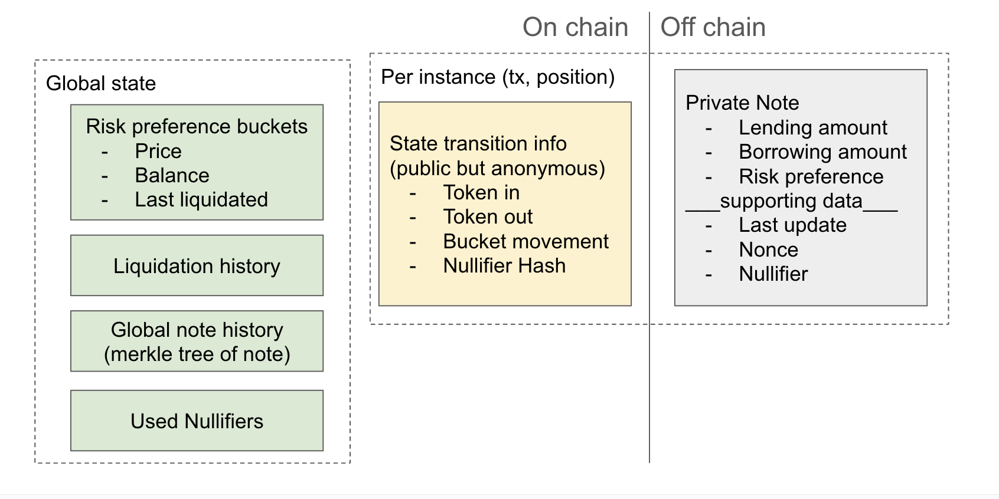

# Noiri: Private Money Market Protocol

Noiri is a native, privacy-preserving money market protocol on Ethereum L1, powered by Noir. It enables users to perform all core banking operations — lend, borrow, repay, and withdraw — with interest accurately accounted for, while ensuring each action is disjointed, revealing no complete view of a user’s overall position.
Most importantly, liquidations are triggered publicly, but who gets liquidated and how much remains fully private.

## Why Private Money Market

Lending/Borrowing is HUGE

- Aave V3 on Ethereum L1 alone handles [$23.6B+](https://www.galaxy.com/insights/research/the-state-of-crypto-lending/) in deposits (31 Mar 25)
- Borrowing and leverage are core financial primitives in DeFi

But Everything is PUBLIC

- On Ethereum L1, your full position is exposed:
  - How much you lent or borrowed
  - Which assets
  - Liquidation thresholds and timing

## Core Challenges

Shared State Limits Logic

- Shielded pools like Aztec Connect aggregate user funds into a single shared state
- Only support group actions like lending, staking, swapping.
- No support for individualized borrowing, interest accrual, or repayments

Stateless Model Breaks Liquidation

- When lending and borrowing are disentangled, there’s not enough information for smart contract to liquidate the position

Increased Trust Assumptions

- Trusted Execution Environments (TEE)
- Sequencers, relayers, or coordinators in Layer 2

## How Noiri Works

### Core Ideas

Public Flow, Private Position

- Assets move around publicly, but the real user's positions are private!
- Liquidations are triggered publicly, but who gets liquidated and how much remains private
- Banking operations (lend, borrow, repay, withdraw) are executed publicly, but each action is disjointed, revealing no complete view of a user’s position (unless the operation changes their risk preference bucket - more on this in [Privacy Analysis](#privacy-analysis) section)

Risk Preference Buckets

- Each buckets is defined by a liquidation price that once crossed, all lending amounts in that bucket are liquidated
- When updating their position, users select their preferred liquidation price, then Noiri computes the possible range of fund movement amount for each banking operation.

Unified Private State Transition Circuit

- A single zkp circuit handles all banking operations constraints
- Enforce other key constraints: LTV, Interest Accrual, Liquidation Checks, and Inclusion Proof

> **Very Important:** Although Noiri's current design significantly enhances privacy in money markets, there are a few caveats to consider to further minimize the potential leakage of a user's full position. See more on [Privacy Analysis](#privacy-analysis) and [Future Improvements](#future-improvements) section for more details.

### Information Architecture

#### Global state (public)

- Risk preference buckets: Track how much collateral must be liquidated when the bucket liquidation price is crossed. Used with Liquidation History to privately verify whether a user's position is liquidated.

- Liquidation history: Logs when and at what price liquidations occur.

- Global note history: Merkle tree of all newly created notes when users update their positions.

- Used Nullifiers: Ensure users cannot reuse old notes after updating their position.

#### State transition info (public but anonymous)

- Token in: The amount of tokens sent into the contract (for lend and repay operations)
- Token out: The amount of tokens withdrawn from the contract (for borrow and withdraw operations)
- Bucket movement: If the user changes their risk preference (i.e., liquidation price), the contract needs to update how much collateral is moved between buckets (from old price to new price). Hence, this leaks data about a user's position -- See more in [Privacy Analysis](#privacy-analysis) zsection
- Nullifier Hash: Each position update emits a new nullifier hash to invalidate the previous note.

#### Private Note (private position)

- Lending amount: Total amount lent (with interest accrued up to the last update)
- Borrowing amount: Total amount borrowed (with interest accrued up to the last update)
- Risk preference supporting data: Indicate the liquidation price this note is tied to (i.e., its risk bucket) up to the last update
- Last update: The time this note was most recently updated
- Nonce: A random secret value to ensure note uniqueness and unlinkability
- Nullifier: A random secret to prevent reuse of previous position notes

### Closer Look at our Zringotts circuit v.0

#### Verify Note Validity

- Merkle proof ensures that the user is authorized to modify the position

#### State Transition Logic

- Update positions based on banking operation type, previous balance, and interest rate
- Interest Accrual: The asset amount is updated on every state change even if the banking operation doesn't directly modify that asset (For example: a 'borrow' operation will still update the lending amount with lending corresponding interest rate)
- Liquidation Settlement: Claim = lending amount x liquidation price - borrowed

#### Requirement check

- LTV threshold: Enforce safe collateralization
- Correct Note construction: Ensure resulting note reflects a valid & updated position

#### Current Limitation

- Fixed lending & borrowing interest rate
- Siloed Market: Only support one pair of asset

### Privacy Analysis

Noiri is designed to preserve privacy at the level of individual positions and state transitions. However, the degree of privacy guarantee depends on whether a user changes their risk preference bucket during an operation.

Below, we analyze both the full privacy case and the partial privacy case -- and show how even in the latter, privacy remains robust through user decision trade off & diversity!

#### Full Privacy: Static Risk Preference Bucket

Complete unlinkability across each operation is preserved when users do not change their risk preference bucket during a state transition.

**For example**, a user lends into a specific liquidation bucket (based on their acceptable risk) and later borrows -- all without changing their bucket.

In this case, each action — lending and borrowing — appears as an isolated, unlinkable transaction:

- One transaction sends tokens in
- Another sends tokens out
- No public correlation between them

Even when repaying or withdrawing, as long as the risk preference bucket remains unchanged, the transaction stays unlinkable to the prior state.

> However, beyond simple lending and borrowing once each, not adjusting the bucket may expose users to unnecessary liquidation risk. That said, some users may choose to accept this trade off in exchange for the maximum privacy.

#### Partial Privacy: Bucket Change

In more realistic scenarios, users may choose to change their risk preference bucket as they update their position (e.g., due to market changes or new risk appetite). In this case, additional data is revealed:

- The amount of collateral (lending asset) moves
- The previous and new risk preference buckets

At first glance, this might appear to enable observers to deterministically infer a user’s borrowing amount. However, this only holds if all users strictly optimize their position to perfectly match each risk preference bucket. In practice, there likely exist many users who do not behave this way -- whether to leave room for adjusting their position without changing bucket or to contribute to collective privacy. It's ok as well for some users to optimize their risk preference bucket; as long as a sufficient number of users don't, the resulting ambiguity makes inference attacks statistically unreliable. This is why in the [Core Ideas](#core-ideas) section, we state that users are presented with a range of possible outcomes and aren’t required to borrow or repay in ways that perfectly optimize their bucket.

In this partial privacy case, users trade off their collateral visibility in exchange for the ability to move around buckets -- without revealing their entire position.

> **In Conclusion** Noiri offers strong privacy guarantees when buckets remain unchanged, and plausible deniability when they do change — especially in a diverse user base where a sufficient number of users don't optimize their position.

### Future Improvements

Besides obvious improvements like supporting variable lending and borrowing interest rates and multiple asset pairs, Noiri's roadmap includes enabling a powerful new capability: **unified cross-margin position**

**Current Limitation: Isolated Bucketed Positions**

In Noiri v0 (this current design), each user position is tied to a specific asset pair and a chosen risk preference bucket.
If a user wants exposure to multiple risk levels, they must open separate notes — for example:

- One position at the $1400 liquidation bucket
- Another at $1600
- Another at $1800

This works well for privacy: since notes are unlinkable, no one can tell these belong to the same user.

However, it introduces friction when the user wants to rebalance across buckets. Suppose a user wants to shift some funds from their $1800 bucket to $1600. If their position at $1800 is already tightly optimized (i.e., near LTV limits, though of course, public wont know it as discussed above), they must repay some debt first to unlock collateral — just to move it. This creates unnecessary overhead and limits flexibility.

**Future Feature: Unified Cross-Margin Positions**

In future versions of Noiri, we aim to support cross-bucket adjustments within a unified margin system, meaning that

- Users can rebalance across multiple buckets within a single virtual position

- Changes in one bucket (e.g., adding risk by moving some funds from $1400 bucket to $1600 bucket) can be offset by reducing risk elsewhere (e.g., shifting some funds from $1800 bucket to $1600 bucket)

- This allows users to optimize their overall risk profile holistically, without micromanaging each note

Importantly, we will explore how to maintain strong privacy guarantees even with this unified margin — including how to avoid correlating sub-positions.

> We’re excited about the composability, capital efficiency, and new privacy trade-offs this will unlock in the world of decentralized money markets.
